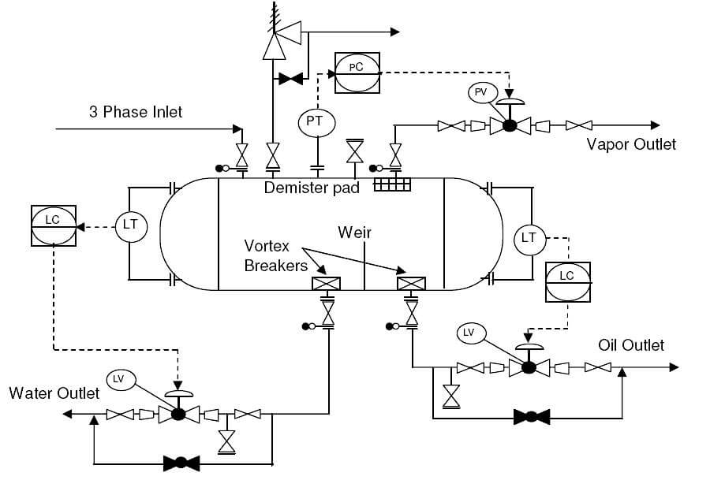
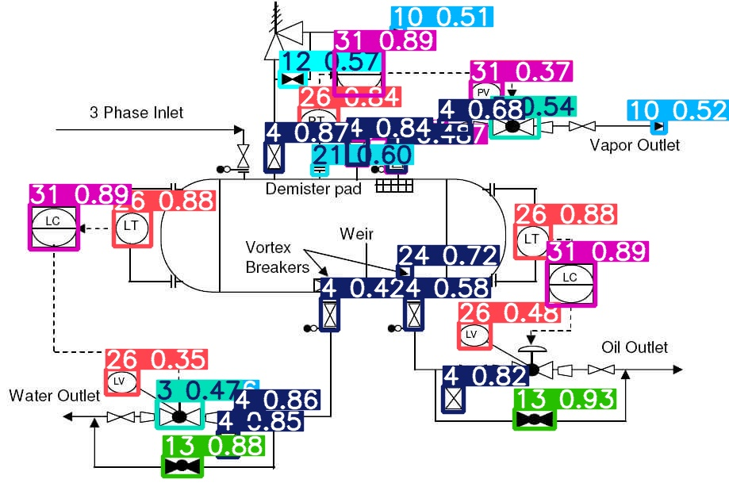

# P&ID Symbol Detection with YOLOv5

This project uses YOLOv5 to detect symbols in Piping and Instrumentation Diagrams (P&IDs). It can identify various engineering symbols commonly found in industrial diagrams, making it useful for automating the interpretation of technical drawings.





## 🔍 Overview

This project implements an object detection system specialized for P&ID diagrams using the YOLOv5 architecture. P&ID diagrams are complex technical drawings used in process engineering that contain various standardized symbols. This tool can automatically identify and locate these symbols, which is useful for:

- Digitizing paper diagrams
- Automating diagram analysis
- Extracting engineering data from drawings
- Quality control and verification

## 🚀 Setup & Installation

### Prerequisites

- Python 3.8 or later
- Git (optional, for cloning YOLOv5)
- CUDA-compatible GPU (optional, for faster processing)

### Installation

1. Clone this repository:
   ```
   git clone https://github.com/talhazuberi71/pid-detection.git
   cd pid-detection
   ```

2. Install dependencies:
   ```
   pip install -r requirements.txt
   ```

3. Run the Jupyter notebook:
   ```
   jupyter notebook yolov5_p&ids.ipynb
   ```

## 🏋️ Model Training

The model is trained on a dataset of P&ID symbols with annotations. To train the model:

1. Run Cell 1-3 to set up YOLOv5 and download the dataset
2. Run Cell 4 and uncomment the training line to start training
3. Training parameters can be adjusted in the `start_yolov5_training()` function
4. Training progress will be displayed in real-time
5. Models are saved to `runs/train/pid_experiment/weights/`

Training typically takes 1-4 hours depending on your hardware. With a GPU, it will be significantly faster.

## 🔮 Inference

To run inference on P&ID diagrams:

The inference results include:
- Annotated images with bounding boxes
- Text files with detection coordinates
- Confidence scores for each detection

## 📊 Results

The model can detect various P&ID symbols including:
- Valves (Gate, Globe, Check, etc.)
- Pumps and Compressors
- Instruments and Meters
- Vessels and Tanks
- Heat Exchangers
- Control Devices

Detection results are saved in the `runs/detect/pid_test/` directory. Each image will have corresponding text files with detection coordinates and class IDs.

### Visualization Customization

- The visualization parameters (box thickness, text size) can be customized in the `customize_visualization()` function

## 🔧 Troubleshooting

### Common Issues

1. **YOLOv5 Setup Fails**:
   - Ensure you have Git installed
   - Try manual download from https://github.com/ultralytics/yolov5

2. **Dataset Download Fails**:
   - Check your internet connection
   - Try downloading directly from https://www.kaggle.com/datasets/hristohristov21/pid-symbols/data

3. **Training Errors**:
   - Ensure PyTorch is correctly installed
   - Check CUDA compatibility if using GPU

4. **Inference Issues**:
   - Verify model path is correct
   - Ensure input image exists and is accessible

## 🙏 Acknowledgements

- [Ultralytics YOLOv5](https://github.com/ultralytics/yolov5) for the object detection framework
- [P&ID Symbols Dataset](https://www.kaggle.com/datasets/hristohristov21/pid-symbols/data) for the training data
- All contributors to the open-source libraries used in this project

---

*For issues, contributions, or questions, please open an issue on GitHub.*
